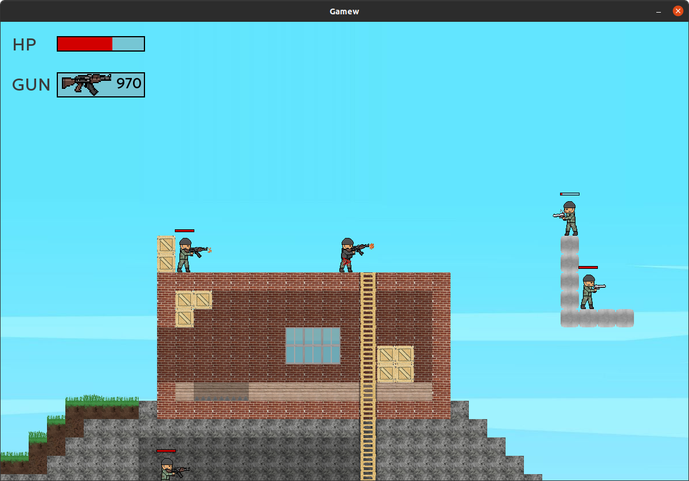
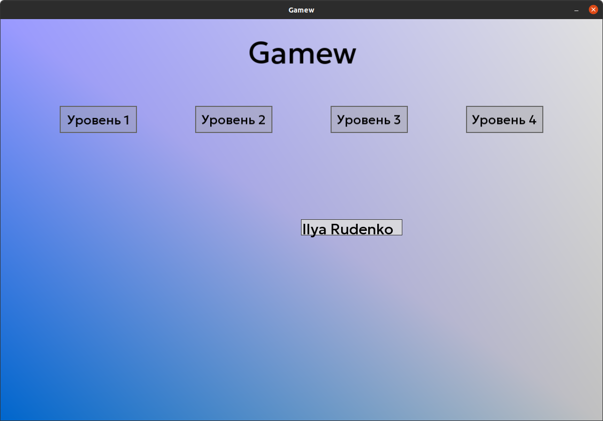

# 2D Gamew (SFMLProj)

### My first released gamew in pure c++ + SFML lib.

### There is a possibility to configere simple GUI.

#### Main classes:
##### &emsp; Gamew - Class for start game
##### &emsp; Player - Relative to the player, all objects move across the screen. When the player moves the 'offsetRelativeCenter' variable changes and all movable objs change their position relative to it
// .....

#### GUI classes:
##### &emsp; Button - A Button class that the user can interact with. Simple effects for hovering and reacting
##### &emsp; TextBox - Simple effects for hovering and binding selected textbox for typing text into it. Check boundaries
##### &emsp; Label - Simple text. There is an animation of the appereance and decay.
